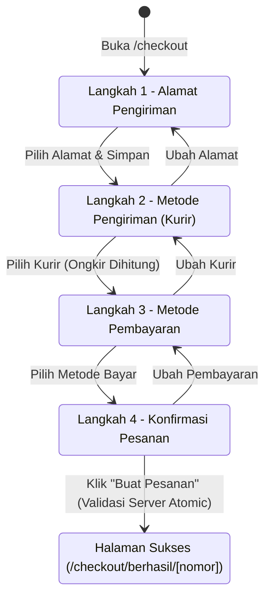
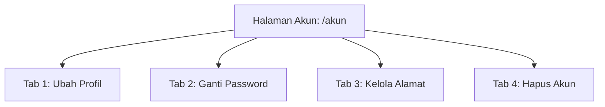

# PRD: Checkout Langkah 3 & 4, Halaman Pesanan Berhasil, dan Halaman Akun Saya — TokoKita

**Dokumen Spesifikasi Kebutuhan Produk (PRD)**
**Target Rilis:** Modul Checkout (Langkah 3 & 4), Pesanan Berhasil, dan Modul Pengguna (`/akun`)
**Status:** Referensi historis pekerjaan A3; bila berbeda, PRD kanonik dan KONTRAK_CHECKOUT yang berlaku.

> Integrasi 1 Oktober 2026 mengikuti PRD kanonik: tidak menambah batas COD Rp 2 juta atau batas GoSend di luar aturan ongkir PRD. Instruksi bayar harus berasal dari gateway/admin yang nyata; data contoh tidak ditampilkan sebagai transaksi berhasil.
**Referensi Utama:** [`docs/PRD - E-Commerce.md`](PRD%20-%20E-Commerce.md) (§7.6, §7.7, §10.5, §10.6, §10.9), [`docs/KONTRAK_CHECKOUT.md`](KONTRAK_CHECKOUT.md), dan [`CLAUDE.md`](../CLAUDE.md).

---

## 1. Ringkasan Eksekutif & Latar Belakang

Dokumen ini mendefinisikan spesifikasi kebutuhan lengkap untuk menyelesaikan seluruh siklus transaksi dan pengelolaan akun pengguna di platform e-commerce **TokoKita**:
1. **Penyelesaian Checkout Wizard (Langkah 3 & 4):**
   - **Langkah 3 (Pembayaran):** Pilihan metode bayar QRIS (GoPay, OVO, DANA), Transfer Bank (BCA, Mandiri), dan COD (Cash on Delivery).
   - **Langkah 4 (Konfirmasi Pesanan):** Tinjauan ringkasan belanja menyeluruh (alamat, ekspedisi, kurir, rincian biaya), form input catatan untuk penjual (*order notes*), penanda progres langkah 1-2-3-4 yang interaktif, dan eksekusi transaksi pesanan melalui Server Action atomic tanpa *overselling*.
2. **Halaman Pesanan Berhasil (`/checkout/berhasil/[nomor]`):**
   - Halaman pasca-checkout yang menampilkan nomor invoice resmi (`INV-YYYYMM-XXXX`), total pembayaran rupiah, status pesanan, hitung mundur (*countdown timer*) batas bayar 24 jam secara real-time, instruksi pembayaran spesifik per metode, dan tautan simulasi pembayaran untuk keperluan verifikasi/demo.
3. **Halaman Akun Saya (`/akun`):**
   - Panel terpusat pengguna yang dilindungi otentikasi (`requireUser`), mencakup 4 fitur utama:
     - **Ubah Profil:** Pembaruan nama dan nomor telepon berformat valid Indonesia.
     - **Ganti Password:** Pembaruan kata sandi aman yang mewajibkan verifikasi kata sandi lama via bcrypt.
     - **Kelola Alamat:** Manajemen buku alamat pengiriman (tambah, edit, hapus, dan atur alamat utama).
     - **Hapus Akun:** Penghapusan akun sesuai kepatuhan UU Pelindungan Data Pribadi (UU PDP) melalui anonimisasi data pribadi tanpa merusak relasi integritas riwayat pesanan akuntansi.
4. **Laporan & Resolusi Bug Sebelumnya:**
   - Rekapitulasi perbaikan isu buffer kosong (0 bytes) pada 9 berkas, penanganan timeout Prisma ketika database lokal offline, dan kepatuhan pengujian ketat (*zero regression*).

---

## 2. Laporan & Resolusi Bug Sebelumnya (Bug Post-Mortem)

### 2.1 Masalah Terdeteksi
1. **File Truncation (0 Bytes):**
   - Terjadi kondisi di mana 9 berkas di direktori `src/` sempat kosong (0 bytes):
     - `src/lib/validations/alamat.ts` & `src/lib/validations/alamat.test.ts`
     - `src/lib/data/alamat.ts`
     - `src/actions/alamat.ts` & `src/actions/checkout.ts`
     - `src/components/checkout/RingkasanPesanan.tsx`
     - `src/components/checkout/AlamatForm.tsx`
     - `src/components/checkout/PilihanKurir.tsx`
     - `src/components/checkout/CheckoutWizard.tsx`
2. **Prisma Connection Hang:**
   - Panggilan query Prisma membeku (hang $\ge 20$ detik) saat koneksi MySQL/MariaDB lokal belum aktif atau port 3306 tidak merespons.
3. **Aksesibilitas & Atribut Form:**
   - Elemen input form membutuhkan pemetaan label `htmlFor` dan `id` yang konsisten agar memenuhi audit aksesibilitas (a11y) dan fitur browser *autofill*.

### 2.2 Status Resolusi & Verifikasi
- **Restorasi Penuh:** Seluruh 9 berkas telah berhasil dipulihkan secara utuh dari riwayat transkrip log terverifikasi.
- **Pemeriksaan File Kosong:** Pemeriksaan `find src/ -type f -size 0` mengonfirmasi **0 berkas kosong**.
- **Hasil Verifikasi Otomatis:**
  - `npm run typecheck`: **PASS** (Route types ter-generate, TypeScript `tsc --noEmit` lolos tanpa error).
  - `npm run lint`: **PASS** (ESLint lolos tanpa peringatan/error).
  - `npm test`: **PASS** (18 test suite, **215 unit tests lolos**, 2 test sandbox diskip sesuai desain).
- **Aturan Pencegahan Ke Depan:**
  - Pemeriksaan `find src/ -type f -size 0` dijalankan wajib sebelum proses commit/verifikasi.
  - Setiap query Prisma di level data layer dibungkus dengan `Promise.race([query, timeoutPromise(2000)])` dan menyediakan fallback data demo terstruktur agar alur UI tetap berjalan mulus.

---

## 3. Spesifikasi Fitur: Checkout Langkah 3 & 4

Alur checkout bertingkat 4 langkah mengikuti diagram status berikut:



### 3.1 Penanda Langkah Wizard (Stepper 1-2-3-4)

Komponen penanda langkah berada di posisi atas form checkout dan bersifat interaktif serta adaptif:
- **Langkah 1:** *Alamat* (Ikon: `MapPin`)
- **Langkah 2:** *Pengiriman* (Ikon: `Truck`)
- **Langkah 3:** *Pembayaran* (Ikon: `CreditCard`)
- **Langkah 4:** *Konfirmasi* (Ikon: `FileCheck`)

#### Aturan Tampilan & Navigasi Stepper:
1. **Indikator Status:**
   - **Selesai (`Completed`):** Lingkaran berwarna primer dengan ikon centang (`Check`). Pengguna dapat mengeklik langkah ini untuk kembali dan mengubah data sebelumnya.
   - **Aktif (`Current`):** Lingkaran berbingkai tebal dengan nomor atau ikon aktif, teks tebal bergaris bawah aksen.
   - **Belum Selesai (`Upcoming`):** Lingkaran abu-abu, teks abu-abu pudar, tidak dapat diklik langsung sampai langkah sebelumnya dipenuhi.
2. **Garis Penghubung:** Garis horizontal dinamis di antara tiap nomor yang berubah warna menjadi warna primer ketika langkah terkait telah terlewati.
3. **Responsivitas:** Pada layar seluler ($< 640\text{px}$), nama label langkah diringkas atau disederhanakan tanpa mengurangi kejelasan alur.

---

### 3.2 Langkah 3: Pilihan Metode Pembayaran

Komponen: `src/components/checkout/PilihanPembayaran.tsx`

Tersedia 4 opsi metode pembayaran yang selaras dengan `enum PaymentMethod` pada `prisma/schema.prisma`:

| Kode Enum | Label UI | Deskripsi & Batas Aturan | Status Awal Pesanan |
|---|---|---|---|
| `qris` | **QRIS (GoPay, OVO, DANA, ShopeePay, dsb.)** | Pembayaran instan via scan QR code standar nasional Indonesia. Berlaku 24 jam. | `status: pending`<br>`paymentStatus: unpaid`<br>`paymentDueAt: now() + 24 jam` |
| `bank_bca` | **Transfer Bank BCA** | Transfer manual / Virtual Account BCA. Instruksi rekening dan kode bayar ditampilkan pasca pesanan dibuat. | `status: pending`<br>`paymentStatus: unpaid`<br>`paymentDueAt: now() + 24 jam` |
| `bank_mandiri` | **Transfer Bank Mandiri** | Transfer manual / Virtual Account Mandiri. Instruksi rekening dan kode bayar ditampilkan pasca pesanan dibuat. | `status: pending`<br>`paymentStatus: unpaid`<br>`paymentDueAt: now() + 24 jam` |
| `cod` | **Bayar di Tempat (COD)** | Pembayaran tunai saat paket diserahkan oleh kurir di alamat tujuan. | `status: confirmed`<br>`paymentStatus: unpaid`<br>`paymentDueAt: null` |

#### Aturan Bisnis Khusus COD (Cash on Delivery):
1. **Batas Nilai Transaksi:** Hanya aktif bila total belanja (`grandTotal`) $\le \text{Rp } 2.000.000$. Jika pesanan melebihi batas ini, opsi COD dinonaktifkan (*disabled*) dengan keterangan: *"COD hanya berlaku untuk total belanja maksimal Rp 2.000.000"*.
2. **Kompatibilitas Kurir:** Hanya berlaku untuk ekspedisi reguler yang mendukung fasilitas penagihan tunai (JNE & SiCepat). Tidak berlaku untuk kurir instan (GoSend).
3. **Status Awal:** Sesuai PRD §10.5 angka 8, pesanan COD langsung berstatus `confirmed` (karena tidak menunggu konfirmasi pembayaran sebelum diproses toko), namun `paymentStatus` tetap `unpaid` sampai paket diserahkan ke pembeli (`delivered`).

#### Interaksi UI:
- Pemilihan berupa kartu radio interaktif. Kartu yang terpilih mendapatkan bingkai berwarna aksen primer dan tanda radio aktif.
- Di bawah opsi terpilih, ditampilkan kotak informasi singkat mengenai tata cara pembayaran.
- Tombol aksi:
  - Tombol **"Kembali ke Pengiriman"** $\to$ kembali ke Langkah 2.
  - Tombol **"Lanjut ke Konfirmasi"** $\to$ melanjutkan ke Langkah 4 (hanya aktif jika salah satu opsi pembayaran telah dipilih).

---

### 3.3 Langkah 4: Konfirmasi Pesanan

Komponen: `src/components/checkout/KonfirmasiPesanan.tsx`

Halaman ringkasan komprehensif sebelum pesanan resmi diterbitkan ke database:

#### Elemen Ringkasan:
1. **Kartu Alamat Pengiriman:**
   - Menampilkan label alamat (misal: "Rumah"), nama penerima, nomor telepon aktif, dan alamat lengkap beserta kode pos.
   - Tombol tautan **"Ubah"** di pojok kanan atas untuk melompat kembali ke Langkah 1.
2. **Kartu Ekspedisi & Pengiriman:**
   - Menampilkan nama kurir terpilih (JNE Regular / SiCepat REG / GoSend Instant), perkiraan durasi sampai, dan total berat paket yang dihitung dari database.
   - Tombol tautan **"Ubah"** untuk melompat kembali ke Langkah 2.
3. **Kartu Metode Pembayaran:**
   - Menampilkan ikon dan nama metode bayar yang dipilih (QRIS, Transfer BCA, Transfer Mandiri, atau COD).
   - Tombol tautan **"Ubah"** untuk melompat kembali ke Langkah 3.
4. **Daftar Barang yang Dipesan:**
   - Tabel/daftar item: gambar thumbnail produk, nama produk, nama varian (jika ada), kuantitas, harga satuan, dan total harga per baris.
5. **Input Catatan untuk Penjual (`notes`):**
   - Area teks opsional (*textarea*).
   - Batas maksimal: 500 karakter dengan counter karakter dinamis (`X/500`).
   - Placeholder: *"Contoh: Tolong bungkus ekstra bubble wrap, warna hitam jika ada"*
   - Sanitasi teks dari sisi client dan server (`z.string().trim().max(500)`).
6. **Rincian Perhitungan Biaya (Server-Verified):**
   - Subtotal Produk (Rp)
   - Biaya Pengiriman / Ongkir (Rp)
   - Diskon Promo Kupon (Rp, bertanda minus jika ada promo aktif)
   - **Total Tagihan / Grand Total (Rp, huruf tebal berukuran besar)**
7. **Tombol "Buat Pesanan":**
   - Tombol utama berukuran penuh (*full width* atau prominen di panel samping).
   - Indikator status mutasi (*loading spinner* & disabled state) untuk mencegah *double submit*.
   - Saat diklik, memicu Server Action `buatPesanan`.

---

### 3.4 Logika Transaksi Server Action `buatPesanan`

File: `src/actions/checkout.ts`

Sesuai aturan keras `CLAUDE.md` #1, #3, #5 dan PRD §10.5, eksekusi pembuatan pesanan **wajib** berada di dalam satu transaksi terisolasi: `prisma.$transaction`.

#### Alur Eksekusi Transaksi:
1. **Otentikasi & Otorisasi:**
   - Panggil `await requireUser('/checkout')`. Ambil `userId` resmi dari sesi JWT cookie terenkripsi.
2. **Validasi Input via Zod:**
   - Validasi data input menggunakan `checkoutSchema`: `addressId`, `shippingMethod`, `paymentMethod`, `notes`, `promoCode`, dan array `items` (`productId`, `variantId`, `quantity`).
3. **Verifikasi Kepemilikan Alamat:**
   - Query tabel `addresses` dengan `where: { id: input.addressId, userId }`. Jika tidak cocok $\to$ batalkan dengan error: *"Alamat pengiriman tidak valid atau tidak ditemukan."*
   - Buat snapshot JSON alamat lengkap untuk disimpan di kolom `orders.shipping_address`.
4. **Hitung Ulang Harga, Berat, & Validasi Stok (Anti-Overselling):**
   - Ambil data produk dan varian langsung dari tabel `products` dan `product_variants`. Abaikan seluruh harga/stok yang dikirim dari browser client!
   - Hitung total berat dalam satuan gram bulat.
   - Periksa ketersediaan stok: Jika produk bukan pre-order (`isPreorder === false`) dan `stock < item.quantity`, transaksi digagalkan seketika dengan pesan: *"Stok [Nama Produk] tidak mencukupi (tersisa [X])."*
5. **Validasi Ulang Kurir & Ongkos Kirim:**
   - Jalankan fungsi hitung ongkir server `hitungOpsiPengiriman(totalWeight, address.city)`.
   - Pastikan metode kurir yang dipilih tersedia dan valid (misal: GoSend hanya untuk kota yang sama dan berat $\le 20.000\text{g}$).
   - Ambil nilai `shippingCost` resmi dari server.
6. **Validasi Ulang Kupon Promo (Jika Ada):**
   - Jika `promoCode` disertakan, verifikasi masa berlaku (`startsAt` & `expiresAt`), keaktifan (`isActive`), kuota pemakaian global (`usedCount < quota`), batasan pemakaian per pengguna (`perUserLimit`), dan syarat minimal subtotal belanja.
   - Hitung nominal diskon resmi.
7. **Deduksi Stok Bersyarat & Peningkatan Statistik:**
   - Kurangi stok produk/varian secara bersyarat:
     ```ts
     const updated = await tx.productVariant.updateMany({
       where: { id: variantId, stock: { gte: quantity } },
       data: { stock: { decrement: quantity } }
     });
     if (updated.count !== 1) throw new Error("STOK_HABIS");
     ```
   - Tambah kolom `soldCount` pada produk terkait.
   - Jika kupon promo digunakan, catat riwayat pemakaian di tabel `promo_usages` dan lakukan `increment: 1` pada kolom `usedCount` di `promo_codes`.
8. **Pemberian Nomor Invoice:**
   - Format: `INV-{YYYY}{MM}-{URUTAN_4_DIGIT}` (misal: `INV-202610-0001`).
   - Urutan direset setiap pergantian bulan berdasarkan pesanan terakhir pada bulan bersangkutan.
9. **Pencatatan Pesanan (`orders`), Item (`order_items`), dan Log Status (`order_status_logs`):**
   - Status pesanan:
     - Jika `paymentMethod === 'cod'`: `status = 'confirmed'`, `paymentStatus = 'unpaid'`, `paymentDueAt = null`.
     - Jika non-COD: `status = 'pending'`, `paymentStatus = 'unpaid'`, `paymentDueAt = now() + 24 jam`.
   - Catat log status pertama di `order_status_logs` (`status = statusAwal`, `note = 'Pesanan dibuat oleh pembeli'`).
10. **Hasil & Respons ke Client:**
    - Mengembalikan objek respons `{ ok: true, orderNumber: string }`.
    - Client merespons dengan mengosongkan state keranjang belanja (`cartStore.clearCart()`) di LocalStorage, lalu melakukan navigasi ke `/checkout/berhasil/{orderNumber}`.

---

## 4. Spesifikasi Halaman Pesanan Berhasil

**Rute:** `/checkout/berhasil/[nomor]`
**Komponen Server:** `src/app/checkout/berhasil/[nomor]/page.tsx`
**Komponen Client Interaktif:** `src/components/checkout/CountdownTimer.tsx`, `src/components/checkout/SimulasiBayarButton.tsx`

### 4.1 Logika Pengambilan Data & Proteksi
- Wajib memanggil `const user = await requireUser('/checkout/berhasil/' + nomor)` di baris awal.
- Mengambil data pesanan dari database:
  ```ts
  const order = await prisma.order.findFirst({
    where: { orderNumber: nomor, userId: user.id },
    include: { items: true }
  });
  ```
- Jika pesanan tidak ditemukan atau `userId` tidak cocok $\to$ tampilkan `notFound()`.

### 4.2 Tata Letak & Elemen UI
1. **Header Berhasil:**
   - Ikon lingkaran centang hijau sukses animasi (`CheckCircle2`).
   - Judul utama: **"Pesanan Berhasil Dibuat!"**
   - Teks pengantar: *"Terima kasih atas pesanan Anda. Silakan selesaikan pembayaran sebelum batas waktu berakhir."*
2. **Kartu Nomor Invoice & Total Tagihan:**
   - **Nomor Pesanan:** Teks tebal format invoice (`INV-202610-0001`) dilengkapi tombol interaktif **"Salin Nomor"** dengan feedback tooltip *"Tersalin!"*.
   - **Total Tagihan:** Nominal rupiah tebal format Indonesia (contoh: `Rp 327.000`).
   - **Status Saat Ini:** Badge status (Kuning untuk *Menunggu Pembayaran*, Biru untuk *Pesanan Dikonfirmasi* pada COD).
3. **Komponen Hitung Mundur 24 Jam (`CountdownTimer`):**
   - Hanya muncul untuk metode pembayaran non-COD (yang memiliki nilai `paymentDueAt`).
   - Menghitung sisa waktu secara mundur detik per detik:
     $$\Delta t = \text{paymentDueAt} - \text{currentTime}$$
   - Format tampilan: `Jam : Menit : Detik` dengan kartu digital menarik.
   - Peringatan warna:
     - Hijau/Netral jika sisa waktu $> 6$ jam.
     - Merah berkedip lembut jika sisa waktu $< 2$ jam.
   - Jika waktu habis ($\Delta t \le 0$): Teks berganti menjadi *"Waktu pembayaran telah berakhir. Pesanan akan dibatalkan otomatis oleh sistem."*
   - Untuk metode COD: Menampilkan kotak peringatan informatif bertuliskan *"Metode Bayar di Tempat (COD): Harap siapkan uang tunai pas saat kurir mengantarkan paket ke alamat Anda."*
4. **Instruksi Detail Pembayaran Berdasarkan Metode:**
   - **Jika QRIS:**
     - Menampilkan mockup/gambar kode QRIS yang jelas.
     - Panduan 3 langkah: (1) Buka aplikasi GoPay/OVO/DANA/BCA Mobile, (2) Scan QRIS di atas, (3) Konfirmasi nominal dan masukkan PIN.
   - **Jika Transfer BCA:**
     - Nomor Virtual Account / Rekening Toko: `80777-0812-3456-7890`.
     - Atas Nama: **PT TokoKita Retail Indonesia**.
     - Tombol cepat **"Salin Nomor Rekening"**.
   - **Jika Transfer Mandiri:**
     - Nomor Virtual Account: `89022-0812-3456-7890`.
     - Atas Nama: **PT TokoKita Retail Indonesia**.
     - Tombol cepat **"Salin Nomor Rekening"**.
5. **Tombol Navigasi & Aksi Pengguna:**
   - Tombol Primer: **"Lihat Riwayat Pesanan"** $\to$ navigasi ke `/akun/pesanan` atau `/akun/pesanan/[nomor]`.
   - Tombol Sekunder: **"Lanjut Belanja"** $\to$ navigasi ke beranda katalog `/`.
   - Tombol Sandbox/Development: **"Simulasi Konfirmasi Bayar (Sandbox)"** $\to$ Server Action bantuan untuk mengubah status pesanan menjadi `confirmed` & `paid` saat pengujian mandiri tanpa menunggu webhook Midtrans asli.

---

## 5. Spesifikasi Halaman Akun Saya (`/akun`)

**Rute:** `/akun`
**Komponen Server:** `src/app/akun/page.tsx`
**Layout/Client Wrapper:** `src/components/account/AkunShell.tsx`
**Proteksi Keamanan:** Wajib memanggil `await requireUser('/akun')` di baris pertama. Akun yang telah berstatus `deletedAt !== null` ditolak otomatis oleh penjaga sesi.

Struktur antarmuka akun dibagi menjadi 4 tab navigasi yang bersih dan intuitif:



---

### 5.1 Tab 1: Ubah Profil

Komponen: `src/components/account/ProfilTab.tsx`
Server Action: `ubahProfil(formData: UbahProfilInput)` di `src/actions/akun.ts`

#### Spesifikasi Field & Formulir:
- **Nama Lengkap (`name`):** Input teks, wajib diisi, 2–100 karakter, trim whitespace.
- **Alamat Email (`email`):** Input teks nonaktif (*read-only / disabled*). Disertai keterangan: *"Alamat email terdaftar dan terikat dengan akun Anda."*
- **Nomor Telepon (`phone`):** Input nomor telepon Indonesia, validasi regex `^(\+62|62|0)8\d{7,12}$`, maksimal 20 karakter.
- **Role Akun:** Tampilan badge read-only (`Pelanggan` atau `Admin`).

#### Alur Eksekusi Server Action `ubahProfil`:
1. Ambil sesi pengguna terotentikasi.
2. Validasi input menggunakan `ubahProfilSchema`.
3. Lakukan update pada tabel `users`:
   ```ts
   await prisma.user.update({
     where: { id: user.id },
     data: { name: input.name, phone: input.phone }
   });
   ```
4. Panggil `revalidatePath('/akun')`.
5. Kembalikan `{ ok: true, message: 'Profil berhasil diperbarui' }`.

---

### 5.2 Tab 2: Ganti Password

Komponen: `src/components/account/PasswordTab.tsx`
Server Action: `gantiPassword(formData: GantiPasswordInput)` di `src/actions/akun.ts`

Sesuai aturan keamanan PRD §10.9 dan `CLAUDE.md` #10:

#### Spesifikasi Field & Formulir:
- **Password Saat Ini (`currentPassword`):** Input password bertopeng (*toggle visibility*), wajib diisi.
- **Password Baru (`newPassword`):** Input password baru, minimal 8 karakter, wajib memuat kombinasi huruf dan angka.
- **Konfirmasi Password Baru (`confirmPassword`):** Input konfirmasi yang wajib cocok persis dengan `newPassword`.

#### Alur Eksekusi Server Action `gantiPassword`:
1. Ambil sesi pengguna terotentikasi.
2. Validasi input form via `gantiPasswordSchema`.
3. Query `passwordHash` pengguna saat ini dari database.
4. Lakukan pencocokan aman menggunakan `bcrypt.compare(input.currentPassword, user.passwordHash)`.
   - Jika **tidak cocok**: Kembalikan `{ ok: false, message: 'Password saat ini tidak sesuai.' }`.
5. Pastikan password baru tidak identik dengan password saat ini.
6. Hash password baru: `const newHash = await bcrypt.hash(input.newPassword, 10)`.
7. Perbarui tabel `users`:
   ```ts
   await prisma.user.update({
     where: { id: user.id },
     data: { passwordHash: newHash }
   });
   ```
8. Kembalikan `{ ok: true, message: 'Password berhasil diubah. Gunakan password baru untuk masuk berikutnya.' }`.

---

### 5.3 Tab 3: Kelola Alamat (Buku Alamat)

Komponen: `src/components/account/AlamatTab.tsx`
Server Actions: Terintegrasi dengan `src/actions/alamat.ts` (`simpanAlamat`, `hapusAlamat`, `setAlamatUtama`).

Pengguna dapat menyimpan beberapa alamat pengiriman untuk mempermudah transaksi checkout berikutnya.

#### Tampilan & Fitur:
1. **Daftar Kartu Alamat:**
   - Menampilkan badge "Alamat Utama" pada alamat default (`isDefault: true`).
   - Rincian alamat: Label ("Rumah", "Kantor"), Nama Penerima, Nomor Telepon, Alamat Jalan, Kecamatan, Kota, Provinsi, Kode Pos.
2. **Aksi Tiap Alamat:**
   - **"Jadikan Alamat Utama":** Mengubah `isDefault = true` untuk alamat terpilih, dan secara otomatis mencabut status default dari alamat lainnya milik pengguna tersebut dalam satu transaksi database.
   - **"Edit Alamat":** Membuka dialog/modal formulir dengan isian data alamat yang sudah terisi sebelumnya untuk diperbarui.
   - **"Hapus Alamat":** Tombol hapus dengan konfirmasi dialog untuk mencegah ketidaksengajaan. Jika alamat dihapus adalah alamat default, alamat pertama yang tersisa secara otomatis dijadikan default.
3. **Tombol "Tambah Alamat Baru":**
   - Membuka modal formulir pembuatan alamat baru menggunakan skema `alamatSchema` yang telah divalidasi dan teruji di `src/lib/validations/alamat.ts`.

---

### 5.4 Tab 4: Hapus Akun (Anonimisasi Sesuai UU PDP)

Komponen: `src/components/account/HapusAkunTab.tsx`
Server Action: `hapusAkun(formData: HapusAkunInput)` di `src/actions/akun.ts`

Sesuai aturan keras PRD §10.9 dan prinsip integritas relasional akuntansi: **Akun pengguna TIDAK BOLEH dihapus secara hard-delete (`DELETE FROM users`)**, karena akan melanggar foreign key transaksi `orders`, `order_status_logs`, dan pembukuan finansial toko.

#### Prosedur Anonimisasi Data Pribadi:
1. **Konfirmasi Keamanan:**
   - Pengguna wajib memasukkan password saat ini untuk membuktikan kepemilikan akun.
   - Pengguna wajib mencentang persetujuan: *"Saya mengerti bahwa akun saya akan dinonaktifkan secara permanen dan seluruh data pribadi akan dihapus."*
2. **Eksekusi Server Action dalam Transaksi:**
   - Verifikasi password via `bcrypt.compare`.
   - Anonimkan data pengguna di tabel `users`:
     - `name = 'Pengguna TokoKita (Dihapus)'`
     - `email = 'deleted-' + userId + '-' + Date.now() + '@tokokita.internal'`
     - `phone = null`
     - `passwordHash = 'DELETED_ACCOUNT_HASH'`
     - `deletedAt = new Date()`
   - Hapus atau anonimkan data di tabel `addresses` milik pengguna.
   - Hapus token reset yang aktif di `password_reset_tokens`.
3. **Pembersihan Sesi:**
   - Hapus cookie otentikasi JWT `auth_token`.
4. **Navigasi Client:**
   - Arahkan pengguna ke halaman beranda `/` dengan notifikasi toast informatif: *"Akun Anda telah berhasil dinonaktifkan."*

---

## 6. Skema Validasi Zod & Kontrak API

### 6.1 Validasi Checkout (`src/lib/validations/checkout.ts`)

```ts
import { z } from 'zod';

export const itemKeranjangSchema = z.object({
  productId: z.number().int().positive(),
  variantId: z.number().int().positive().nullable(),
  quantity: z.number().int().min(1).max(99),
});

export const checkoutSchema = z.object({
  addressId: z.number().int().positive({ error: 'Pilih alamat pengiriman terlebih dahulu' }),
  shippingMethod: z.enum(['jne_reg', 'sicepat_reg', 'gosend_instant'], {
    error: 'Pilih kurir pengiriman yang valid',
  }),
  paymentMethod: z.enum(['qris', 'bank_bca', 'bank_mandiri', 'cod'], {
    error: 'Pilih metode pembayaran yang valid',
  }),
  promoCode: z
    .string()
    .trim()
    .toUpperCase()
    .max(30)
    .optional()
    .transform((s) => s || null),
  notes: z
    .string()
    .trim()
    .max(500, { error: 'Catatan untuk penjual maksimal 500 karakter' })
    .optional()
    .transform((s) => s || null),
  items: z
    .array(itemKeranjangSchema)
    .min(1, { error: 'Keranjang belanja masih kosong' })
    .max(50, { error: 'Maksimal 50 item per pesanan' })
    .refine(
      (items) => new Set(items.map((i) => `${i.productId}:${i.variantId}`)).size === items.length,
      { error: 'Terdapat produk duplikat di dalam keranjang belanja' }
    ),
});

export type CheckoutInput = z.infer<typeof checkoutSchema>;
```

### 6.2 Validasi Akun (`src/lib/validations/akun.ts`)

```ts
import { z } from 'zod';

const phoneRegex = /^(\+62|62|0)8\d{7,12}$/;

export const ubahProfilSchema = z.object({
  name: z
    .string()
    .trim()
    .min(2, { error: 'Nama minimal 2 karakter' })
    .max(100, { error: 'Nama maksimal 100 karakter' }),
  phone: z
    .string()
    .trim()
    .regex(phoneRegex, { error: 'Format nomor telepon tidak valid (contoh: 081234567890)' })
    .max(20, { error: 'Nomor telepon maksimal 20 digit' })
    .nullable()
    .optional()
    .transform((s) => s || null),
});

export const gantiPasswordSchema = z
  .object({
    currentPassword: z.string().min(1, { error: 'Password saat ini wajib diisi' }),
    newPassword: z
      .string()
      .min(8, { error: 'Password baru minimal 8 karakter' })
      .regex(/^(?=.*[a-zA-Z])(?=.*\d)/, {
        error: 'Password harus memuat kombinasi huruf dan angka',
      }),
    confirmPassword: z.string().min(1, { error: 'Konfirmasi password wajib diisi' }),
  })
  .refine((data) => data.newPassword === data.confirmPassword, {
    message: 'Konfirmasi password baru tidak cocok',
    path: ['confirmPassword'],
  })
  .refine((data) => data.currentPassword !== data.newPassword, {
    message: 'Password baru tidak boleh sama dengan password saat ini',
    path: ['newPassword'],
  });

export const hapusAkunSchema = z.object({
  password: z.string().min(1, { error: 'Masukkan password Anda untuk konfirmasi penghapusan' }),
  konfirmasi: z.literal(true, {
    error: 'Anda harus menyetujui konsekuensi penghapusan akun',
  }),
});
```

---

## 7. Rencana Pengujian (Test Plan) & Standar Verifikasi

Sebelum implementasi dianggap selesai dan siap untuk Pull Request, seluruh standar verifikasi proyek TokoKita harus dipenuhi:

### 7.1 Unit Testing (Vitest)
1. **Validasi Checkout & Akun:**
   - `src/lib/validations/checkout.test.ts`: Uji seluruh skema batas Zod (kuantitas item 0, item > 50, duplikasi varian, panjang catatan $> 500$, enum kurir & bayar).
   - `src/lib/validations/akun.test.ts`: Uji validasi profil nama kosong, regex nomor HP Indonesia, panjang password, kesesuaian konfirmasi password, serta persetujuan hapus akun.
2. **Hitungan & Logika Bisnis:**
   - Uji batas maksimum nilai transaksi COD ($\le \text{Rp } 2.000.000$).
   - Uji penentuan status awal pesanan COD vs Non-COD.
   - Uji hitung mundur waktu `paymentDueAt` (format jam-menit-detik, penanganan waktu kedaluwarsa).
3. **Server Actions (Mocked Prisma Transaction):**
   - Uji Server Action `buatPesanan`: verifikasi pemotongan stok bersyarat, kalkulasi total dari database, rollback jika stok tidak cukup, dan pembuatan nomor invoice bulanan.
   - Uji Server Action `ubahProfil`, `gantiPassword` (verifikasi bcrypt compare), dan `hapusAkun` (verifikasi anonimisasi dan pencabutan sesi).

### 7.2 Gate Verification Checklist
- [x] **Integritas Berkas:** Tidak ada berkas berukuran 0 byte (`find src/ -type f -size 0` mengembalikan 0).
- [ ] **Typecheck:** `npm run typecheck` $\to$ PASS tanpa kesalahan tipe data TypeScript.
- [ ] **Linting:** `npm run lint` $\to$ PASS tanpa error ESLint.
- [ ] **Testing:** `npm test` $\to$ Seluruh unit tests lolos (target $\ge 225$ unit tests PASS).
- [ ] **Build:** `npm run build` $\to$ Next.js App Router mengompilasi rute statis dan dinamis dengan sukses.

---

## 8. Matriks Peran & Tanggung Jawab Anggota Tim

| Modul / Komponen | Berkas Terkait | Penanggung Jawab |
|---|---|---|
| Skema Zod & Validasi Form | `src/lib/validations/checkout.ts`, `akun.ts` | A4 (Backend / Validasi) |
| Server Action Pesanan & Akun | `src/actions/checkout.ts`, `src/actions/akun.ts` | A4 (Database & Transaksi) |
| Komponen UI Checkout 3 & 4 | `PilihanPembayaran.tsx`, `KonfirmasiPesanan.tsx`, `CheckoutWizard.tsx` | A3 (Frontend Checkout) |
| Halaman Sukses & Countdown | `src/app/checkout/berhasil/[nomor]/page.tsx`, `CountdownTimer.tsx` | A3 (Frontend Checkout) |
| Halaman Akun & Komponen Tab | `src/app/akun/page.tsx`, `src/components/account/*` | A1 & A3 (Frontend Akun) |
| Review Keamanan & Kepatuhan PDP | Seluruh modul akun & sanitasi data | A2 (Security Reviewer) |
